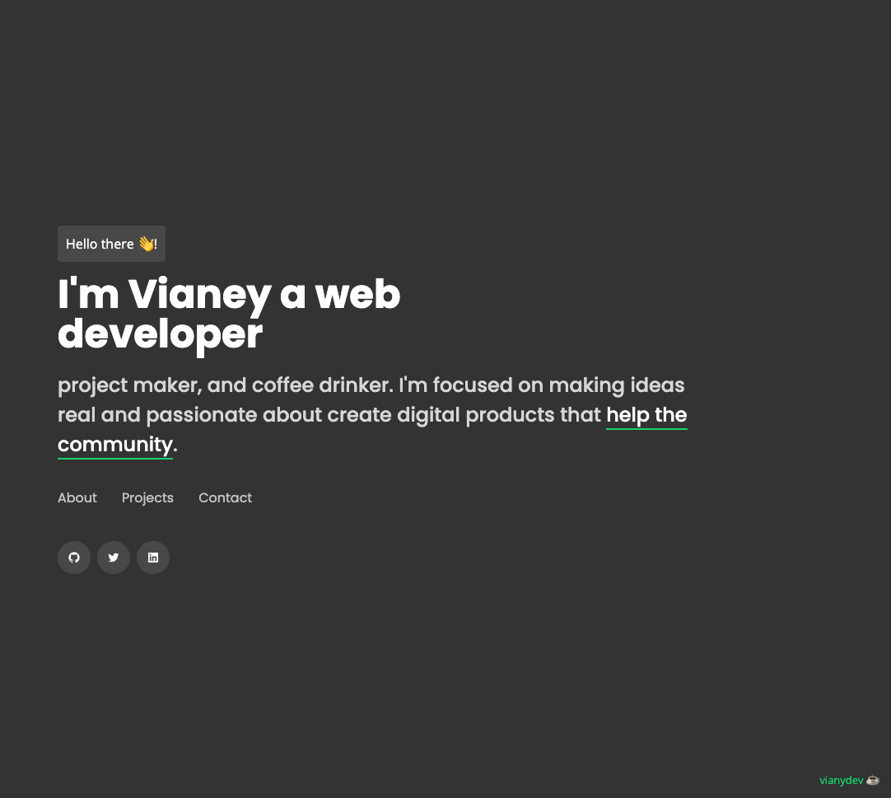

# Vianydev site

## Table of contents

- [Overview](#overview)
  - [The challenge](#the-challenge)
  - [Screenshot](#screenshot)
  - [Links](#links)
- [My process](#my-process)
  - [Built with](#built-with)
  - [Useful resources](#useful-resources)
- [Author](#author)

## Overview

### Screenshot

### Links

- URL: [URL](https://github.com/vianydev/vianydev-portfolio)
- Live Site URL: [Live site URL](https://your-live-site-url.com)

## My process

### Built with

- Semantic HTML5 markup
- CSS custom properties
- Flexbox
- CSS Grid
- Mobile-first workflow
- [React](https://reactjs.org/) - JS library
- [Waypoints](http://imakewebthings.com/waypoints/guides/getting-started/)- for
- [Swiper](https://swiperjs.com) - For 

### Useful resources

- [Example resource 1](https://www.example.com) - This helped me for XYZ reason. I really liked this pattern and will use it going forward.

## Author

- Twitter - [@vianydev](https://www.twitter.com/vianydev)
- Linkedin - [@vianydev](https://www.linkedin.com/in/vianydev/)
- Github - [@vianydev](https://github.com/vianydev)
